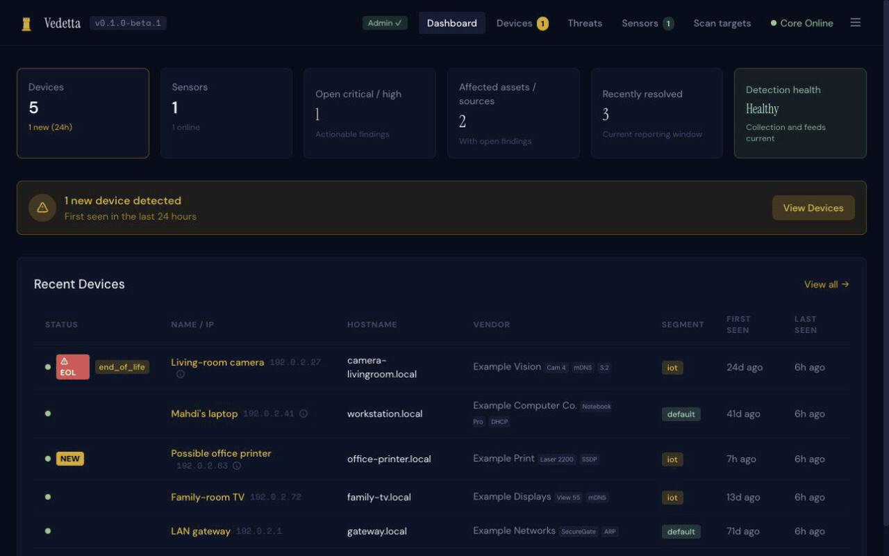

# Vedetta

[](https://github.com/MahdiHedhli/vedetta/actions/workflows/pages.yml)

**Your network, under watch.** DNS-first security monitoring for homes and small businesses.

Vedetta is a lightweight, self-hosted security monitoring platform. Today it is strongest at DNS-first visibility and detection, active and passive device discovery, and local threat scoring. The current product stands on its own locally, can optionally pull value from existing DNS infrastructure such as Pi-hole or AdGuard Home, and is currently public beta software for homelabs, technical home users, small businesses, and hands-on operators.



_Animated tour shown with synthetic documentation-only demo data._

## What Vedetta Is Today

- **Vedetta Core** runs in Docker Compose and provides the API, dashboard, local storage, and ingest pipeline.
- **Vedetta Sensor** runs natively on the network you want to inspect and handles active device discovery, passive ARP/DHCP/mDNS/SSDP visibility, and passive DNS capture.
- **DNS detections** include DGA, beaconing, tunneling, rebinding, and DNS bypass scoring.
- **Threat enrichment** is local-first, backed by curated feeds, and can consume the advisory Vedetta community snapshot.
- **Asset-centered findings** turn repeated raw signals into durable, device-linked, explainable alerts with lifecycle, outcome, evidence, and recommended action.
- **EOL Router & Camera Detection** — Detects specific end-of-life and vulnerable router and camera models listed in the [FBI IC3 FLASH 2026-03-12 advisory](https://www.ic3.gov/CSA/2026/260312.pdf) (AVrecon malware / SocksEscort) and applies elevated risk scoring when they exhibit suspicious behavior.
- **Optional DNS integrations** include Pi-hole and AdGuard Home if you already run them ([setup guide](docs/connectors/dns-pollers.md)).
- **Router and firewall work** has started in code, but broader log aggregation and connector coverage still belong in the roadmap.

## Who It Is For Today

Vedetta currently fits best for:

- homelab users
- technical home users
- small businesses without a full SOC
- consultants, MSPs, and security practitioners helping very small environments

Vedetta is not yet a plug-and-play consumer appliance. The current install path assumes Docker, a native sensor, local network access, and some comfort with `sudo`.

## Required Vs Optional

### Required today

- Vedetta Core
- at least one sensor on the network segment you want to inspect

### Optional today

- Pi-hole integration
- AdGuard Home integration
- telemetry contribution (on by default, opt-out)
- public community-feed consumption (on by default, independently disableable)
- early router and firewall connector experimentation

Pi-hole and AdGuard Home are **optional integrations**, not the product identity. Vedetta is being built to ingest useful signals from multiple DNS and network sources over time.

## Status

Major features are developed spec-first under [`specs/`](specs/), validated against
the [project constitution](.specify/memory/constitution.md).

### Available now

- Docker-based Core with dashboard, API, and SQLite-backed storage
- native sensor for macOS, Linux, and Windows install paths
- passive DNS capture plus active and passive device discovery
- log ingestion pipeline (`POST /api/v1/ingest` + events query API + retention enforcer)
- DNS-first threat scoring and local enrichment
- EOL Router & Camera Detection (FBI IC3 2026-03-12 advisory) plus device risk categories (`known_exploited` / `eol_eos` / `high_risk_iot`)
- **UniFi log ingestion** ([specs/001](specs/001-unifi-log-ingestion/), [setup guide](docs/connectors/unifi.md)): collector CEF/syslog parser → `firewall_log` events, firewall-aware scoring, seeded noise suppression, optional REST connector, UI filters — syslog path implemented, live SNR validation pending
- **passive discovery correlation** ([specs/004](specs/004-passive-discovery-correlation/)): multi-signal identity resolution surviving DHCP churn, confidence-weighted provenance, mDNS record-graph parsing, per-device display name, multi-segment attachments
- richer sensor payloads (`dns_answers`, `server_ip`, `services`, `discovery_source`)
- event-time stable asset identity with temporal address history, locally HMACed passive identity evidence, and audited confirm/merge/undo workflows
- one replay-safe server-side processing path for sensor DNS, Pi-hole, AdGuard, collector/syslog, and direct UniFi events
- durable findings with exact typed evidence, seven-day recurrence, Open/Investigating/Resolved lifecycle, and separate suppression disposition
- findings-first threat view with distinct healthy-empty, initializing, stale, failure, and authentication states
- optional Pi-hole and AdGuard Home pollers
- device inventory, scan targets, whitelist, suppression, and activity logging

### Community sharing

- **Telemetry service** ([specs/002](specs/002-telemetry-service/)): **on by default, opt-out** — set `VEDETTA_TELEMETRY_OPTIN=false` on the telemetry service (only the exact value `false` disables it) and restart it for a process-level hard stop before the telemetry daemon reads Core data or performs network egress, or use the dashboard telemetry toggle to control Core's live gate. A one-time first-run acknowledgement dialog discloses the effective state and privacy boundary. Direct continuation records acknowledgement immediately; **Manage in Settings** records it only after an authenticated admin reaches Settings, while cancellation or failed authentication records nothing and returns the notice. Sharing is **privacy-reduced and pseudonymous, not anonymous**. For beta, each signal contains a Core-confirmed public block-list domain and its eTLD+1, hourly event bucket, observation/distinct-asset/blocked counts, local confidence, fixed reason codes, and signal/batch IDs and timing metadata; registration sends a random install UUID, version, and capability names and receives a stable reporter pseudonym. Internal/device IPs, MACs, hostnames, raw queries, and per-asset hashes are not serialized. The service does not retain the install UUID, but stores the pseudonym linked to signal and exact receipt/merge/last-seen timing; signals and receipts expire after 30 days while reporter/derived-record expiry remains incomplete. Cloudflare observes the public connection source/timing, and the service transiently holds that public address as an in-memory rate-limit key until swept after 30 idle minutes (not SQLite/application logs). Query-derived candidate and behavior signals are disabled pending a trust-model redesign. See [PRIVACY.md](PRIVACY.md) for the exhaustive wire/storage model and the [anonymization + residual-linkability analysis](specs/003-threat-network/anonymization-proof.md).
- **Community threat network** ([specs/003](specs/003-threat-network/)): implemented advisory-only community feed with reporter-consensus confidence and abuse resistance.
- **Core feed consumer**: refreshes the public snapshot every 15 minutes by default. Community matches are corroborating evidence only and cannot independently create or raise a finding; set `VEDETTA_COMMUNITY_FEED_ENABLED=false` for offline/local-only consumption.

### In progress

- live SNR / operational validation of the newly implemented UniFi source on real deployments
- install and onboarding polish for public beta users
- broader dashboard/admin auth hardening plus sensor token rotation

### Planned next

- broader firewall log aggregation after UniFi is validated on real hardware:
  OpenWRT, pfSense/OPNsense, and MikroTik ([specs/005](specs/005-broader-firewall-connectors/), one source at a time)
- more local DNS collection options for advanced deployments

## Quick Start

> **Transport (secure by default): the Quick Start publishes Core and the dashboard
> to the host loopback only (`127.0.0.1`) — they are NOT on your LAN.** The dashboard
> is reachable at `http://localhost:…` from the machine running Compose, and no
> bearer tokens are exposed on the network out of the box. To reach Vedetta from
> another machine you must make an **explicit choice**: front it with the documented
> **TLS reverse proxy** (recommended — [Reverse Proxy & TLS](docs/reverse-proxy.md)),
> or knowingly change the port bindings in `docker-compose.yml` from `127.0.0.1:` to
> `0.0.0.0:`, accepting that tokens then travel your LAN as plaintext HTTP. Insecure
> LAN exposure is never the silent default. There is no in-app TLS and no sensor
> `--cacert` flag today; native-sensor certificate trust relies on the host system
> CA store. (The syslog collector port stays LAN-reachable — it must receive logs
> from your network devices and carries no admin credentials.)

### 1. Start Vedetta Core

```bash
git clone https://github.com/MahdiHedhli/vedetta.git
cd vedetta

# Generate machine credentials FIRST (writes ./.env with distinct random
# ingest/read tokens and a single-use first-admin setup code). Skipping this
# leaves Core without a setup code and the onboarding wizard cannot mint the
# first admin token.
./scripts/gen-env.sh

docker compose up -d
```

`gen-env.sh` prints the first-admin **setup code** — keep it handy. On first
launch the dashboard's onboarding wizard prompts for it to create your initial
admin token. (If you ever lose it, Core also prints the active setup code to its
logs on first start: `docker logs vedetta-backend`.)

**`gen-env.sh` also probes the host ports** the stack publishes (`8080`, `3107`,
`5140`). When a supported probe tool succeeds, an occupied port (a common case —
e.g. another web server owns `127.0.0.1:8080`) is replaced by the next confirmed
free port and pinned in `.env`. If no probe tool is installed, the script labels
the values as unverified; if a detected tool fails, setup stops unless you
explicitly choose `VEDETTA_SKIP_PORT_PROBE=1`. It then prints the **actual**
dashboard / Core / collector URLs — use those throughout onboarding. You can
export a preferred `VEDETTA_*_PORT`, but Docker Compose also gives that export
precedence over `.env`; if probing has to shift it, setup stops and asks you to
unset it or choose a free value instead of writing a configuration Compose would
silently override. You can
retrieve the same effective values later without sourcing the secret-bearing
`.env`:

```bash
BACKEND_PORT="$(./scripts/resolve-host-port.sh VEDETTA_BACKEND_PORT 8080)"
FRONTEND_PORT="$(./scripts/resolve-host-port.sh VEDETTA_FRONTEND_PORT 3107)"
COLLECTOR_PORT="$(./scripts/resolve-host-port.sh VEDETTA_COLLECTOR_PORT 5140)"
```

With the defaults free you get:

Dashboard: [http://localhost:3107](http://localhost:3107)
API health: [http://localhost:8080/healthz](http://localhost:8080/healthz)

The detailed `/api/v1/status` endpoint is authenticated. Query the selected Core
port with a read or admin token:

```bash
BACKEND_PORT="$(./scripts/resolve-host-port.sh VEDETTA_BACKEND_PORT 8080)"
export VEDETTA_TOKEN='<read-or-admin-token-from-the-dashboard>'
curl -H "Authorization: Bearer $VEDETTA_TOKEN" \
  "http://localhost:${BACKEND_PORT}/api/v1/status"
unset VEDETTA_TOKEN
```

### 2. Deploy A Sensor

**Create your admin token first (step 1's onboarding wizard), then enroll the
sensor.** Core always requires a one-time **enrollment code** to register a new
sensor (admin-before-sensor — there is no open bootstrap). Generate one from the
dashboard onboarding wizard (the "Connect a sensor" step) and pass it as
`--enroll-code`.

> **What address goes in `--core`?** Core is **loopback-only by default** (see the
> transport note above), so the right value depends on where the sensor runs:
>
> - **Sensor on the SAME host as Core** (e.g. a dev box or single-node install):
>   use the **Core API URL printed by `gen-env.sh`**. It is
>   `http://localhost:8080` by default, but its port is the generated
>   `VEDETTA_BACKEND_PORT` value when that default was occupied or overridden.
> - **Sensor on ANOTHER machine** (the usual case): Core's loopback-bound host
>   port is *not* reachable across the network, and you should never send bearer tokens
>   over plaintext HTTP on your LAN. Stand up the [TLS reverse proxy](docs/reverse-proxy.md)
>   and point `--core` at that HTTPS hostname, e.g. `https://vedetta.example.com`.
>   A plaintext `http://<CORE_IP>:<BACKEND_PORT>` only works if you have *knowingly* rebound
>   the port to `0.0.0.0` in `docker-compose.yml`, accepting cleartext tokens.

Review the installer, then run it against your Core instance. Replace
`https://vedetta.example.com` with your reverse-proxy hostname (or the Core API
URL printed by `gen-env.sh` for a same-host sensor):

**macOS / Linux:**

```bash
curl -fsSL -o /tmp/vedetta-sensor-install.sh \
  https://raw.githubusercontent.com/MahdiHedhli/vedetta/main/sensor/deploy/install.sh

sudo bash /tmp/vedetta-sensor-install.sh \
  --core https://vedetta.example.com \
  --enroll-code <ENROLL_CODE>

# update an already-enrolled sensor (no code needed):    sudo bash /tmp/vedetta-sensor-install.sh --core https://vedetta.example.com
# override LAN auto-detection:                           --cidr 192.168.1.0/24
# reset a stranded sensor (then re-enroll with a code):  sudo bash /tmp/vedetta-sensor-install.sh --core https://... --reset --enroll-code <CODE>
```

**Windows** (driver-free — no Npcap, no nmap). Run in an **elevated** PowerShell; pin
the release with `-Tag`:

```powershell
# review the script first: https://github.com/MahdiHedhli/vedetta/blob/main/sensor/deploy/install.ps1
irm https://raw.githubusercontent.com/MahdiHedhli/vedetta/main/sensor/deploy/install.ps1 -OutFile install.ps1
.\install.ps1 -Core https://vedetta.example.com -EnrollCode <ENROLL_CODE> -Tag v0.1.0-beta.2

# update an already-enrolled sensor (no code needed):   .\install.ps1 -Core https://vedetta.example.com
# override LAN auto-detection:                           -CIDR 192.168.1.0/24
# reset a stranded sensor (then re-enroll with a code):  .\install.ps1 -Core https://... -Reset -EnrollCode <CODE>
# uninstall:  Stop-Service VedettaSensor; sc.exe delete VedettaSensor; Remove-Item 'C:\Program Files\Vedetta','C:\ProgramData\Vedetta' -Recurse -Force
```

> **Always go admin-first — there is no open bootstrap.** Create your admin via the
> dashboard onboarding wizard (using the setup code from `gen-env.sh`), mint a
> one-time enrollment code in the wizard's "Connect a sensor" step, then enroll the
> sensor with the code. The **enrollment code is never stored in the service
> configuration**: the installer spends it in a one-shot elevated enrollment step
> (with the code passed via the environment, not a command line) and the service runs
> only with the persisted token. Re-run the installer without the code to update an
> already-enrolled sensor.

Current public install paths:

- **macOS / Linux** (`install.sh`): installs dependencies, downloads a checksum-verified
  binary (or builds from source), registers a launchd/systemd service; prints a
  capture-interface recommendation and supports `--dns-iface` / `--passive-iface`.
- **Windows 11 / 10 22H2 / Server 2022** (`install.ps1`): driver-free — DNS via the
  `Microsoft-Windows-DNS-Client` ETW provider, discovery via native ICMP/ARP (no Npcap,
  no nmap). Registers a LocalSystem service; host-scoped capture in v1.
- All paths use elevated privileges for the strongest local visibility.

If you prefer to build manually:

```bash
cd sensor
go build -o vedetta-sensor ./cmd/vedetta-sensor
# --core: https://<your-reverse-proxy-host> for a remote sensor, or the Core API
# URL printed by gen-env.sh when the sensor runs on the same host as Core.
sudo ./vedetta-sensor --core https://vedetta.example.com --enroll-code <ENROLL_CODE>
```

(`--enroll-code` is always required to register a new sensor — enrollment is
admin-first, so mint the code in the onboarding wizard after creating your admin.
You can also set `VEDETTA_ENROLL_CODE` instead of the flag.)

Useful sensor diagnostics (use the same `--core` address as above):

```bash
./vedetta-sensor --core https://vedetta.example.com --cidr 10.0.0.0/24 --print-capture-plan
```

That command prints the recommended DNS and passive-discovery interfaces, explains why they were chosen, and shows the override flags if you need to pin a different interface on a laptop, VPN client, or multi-homed host.

### 3. Update Vedetta

```bash
./scripts/update-all.sh
./scripts/update-core.sh
./scripts/update-sensor.sh
```

**Back up before updating.** Migrations run automatically on start; a backup is
your rollback path. See [Backup, Restore & Rollback](docs/backup-restore-rollback.md)
for the online-backup command and a safe update/rollback flow.

## Architecture

Vedetta uses a **Core + Sensor** model:

- **Core** is the Docker-based control plane: API, UI, storage, enrichment, and ingestion
- **Sensor** is the native network-side component: active and passive discovery, passive DNS capture, and scan execution

This split is deliberate. The local network is the strongest source of truth Vedetta has today, and native sensor access is more reliable than relying on containers alone for that visibility.

## Services

Ports below are the **defaults**. When host-port probing is available and
successful, `scripts/gen-env.sh` pins the next confirmed free port in `.env` if a
default is taken. Otherwise it clearly labels the values as unverified or stops
on probe failure. The generated `.env` and the script's output are the source of
truth.

| Service | Default port | `.env` override | Purpose |
| --- | --- | --- | --- |
| Backend | 8080 | `VEDETTA_BACKEND_PORT` | API, device/event storage, enrichment, scan coordination |
| Frontend | 3107 | `VEDETTA_FRONTEND_PORT` | Dashboard UI |
| Collector | 5140/udp | `VEDETTA_COLLECTOR_PORT` | Syslog and normalized log ingestion path |
| Telemetry | - | - | Privacy-reduced community sharing, **on by default** (opt out: `VEDETTA_TELEMETRY_OPTIN=false` or the dashboard toggle) |
| Threat Network | 9090 | - | Optional community backend (advisory-only feed) |

## Hardware And Platform Notes

- **Core:** Raspberry Pi 4 (4 GB RAM) or a small x86 box is a reasonable target for public beta deployments.
- **Sensor (macOS/Linux):** a host with `nmap` on the network segment you want to inspect; installs with `sensor/deploy/install.sh`.
- **Sensor (Windows):** Windows 11, Windows 10 22H2, or Server 2022. Driver-free — DNS via the `Microsoft-Windows-DNS-Client` ETW provider and discovery via native ICMP/ARP, so **no Npcap and no nmap**. Installs with `sensor/deploy/install.ps1` (run as Administrator) and runs as a LocalSystem service. v1 capture is **host-scoped** (this machine's DNS); segment-wide L2 capture via optional Npcap is a later, never-required tier.
- **Core on Windows:** runs via Docker (Desktop/WSL2).

## Router And Firewall Integrations

Vedetta is not just a Pi-hole companion. DNS is the current wedge, but the product is being expanded to pull value from multiple visibility layers.

Current state:

- UniFi log ingestion is implemented: the collector normalizes UniFi CEF/legacy-syslog on the configured `VEDETTA_COLLECTOR_PORT` (UDP 5140 by default) into `firewall_log` events through `POST /api/v1/ingest`, with firewall-aware scoring and seeded noise suppression; setup guide at [docs/connectors/unifi.md](docs/connectors/unifi.md)
- an optional off-by-default REST connector (`backend/internal/firewall/`) adds UniFi client-inventory enrichment
- syslog is the working path; a live ≥72h SNR validation on real UniFi hardware is pending before it is called fully "supported"

Planned next (deliberately one source at a time, after UniFi is validated):

1. OpenWRT
2. pfSense / OPNsense
3. MikroTik

These should be described honestly as early or planned until they are documented and proven in the public workflow.

## Privacy And Trust

- **Self-hosted first.** The local deployment is the product.
- **Local value first.** Device discovery, DNS visibility, and local detections should remain useful without cloud dependency.
- **Telemetry is on by default and opt-out.** Set `VEDETTA_TELEMETRY_OPTIN=false` (only the exact value `false`) on the telemetry service and restart it for a process-level hard stop before the telemetry daemon reads Core data or performs network egress; the dashboard toggle independently controls Core's live gate, whose saved value overrides Core's environment default. The one-time first-run dialog surfaces the effective state. Choosing **ACKNOWLEDGED** or **CONTINUE** records the acknowledgement immediately. Choosing **Manage in Settings** defers it until an authenticated admin actually reaches Settings; cancelling or failing authentication records nothing, so the notice returns. The acknowledgement is stored only in browser-origin local storage and is versioned: a material disclosure revision re-prompts that browser origin, while another browser or origin acknowledges independently.
- **Community threat sharing is on by default, advisory-only, and pseudonymous (not anonymous).** For beta, signals carry the matched public block-list domain/eTLD+1, an hourly event bucket, counts, local confidence/fixed reasons, random IDs, and batch/window timing; registration also sends a random install UUID, version, and capability names. Internal/device IPs, MACs, hostnames, raw queries, and the local per-instance salted HMAC are never serialized. The server does not retain the install UUID, but its stable `reporter_id` links signal rows and exact receipt/merge/last-seen timing; signal rows and receipts expire after 30 days, while reporter/counter/derived-record expiry is incomplete. Cloudflare sees each connection's public source/timing, and Vedetta transiently uses that public address as an in-memory rate-limit key until swept after 30 idle minutes; it is not written to SQLite or application logs. Query-derived candidate/behavior signals are disabled for beta. See [PRIVACY.md](PRIVACY.md) for the precise field/retention model and the [anonymization + residual-linkability analysis](specs/003-threat-network/anonymization-proof.md); opt out any time.

## Known Beta Limits

- Core plus native sensor is still the real deployment model.
- Install still assumes Docker, a native sensor, and some comfort with local networking and `sudo`.
- Sensor bearer auth is in place, but broader dashboard/admin auth hardening is still in progress.
- Telemetry contribution is on by default (opt out via `VEDETTA_TELEMETRY_OPTIN=false` or the dashboard toggle). Independently, Core refreshes the public community snapshot every 15 minutes unless `VEDETTA_COMMUNITY_FEED_ENABLED=false`; the credential-free GET contains no local event/device/query data, and matches are advisory/corroborating only.
- UniFi log ingestion is implemented (syslog path) but has not completed its live ≥72h SNR validation on real hardware, so it is not yet labelled fully "supported".

## Documentation

- [Working Backlog](docs/backlog.md)
- [Architecture Reference](docs/architecture.md)
- [Project Roadmap](docs/roadmap.md)
- [Sensor Architecture](docs/sensor-architecture.md)
- [Pi-hole And AdGuard Home Setup](docs/connectors/dns-pollers.md)
- [UniFi Connector Setup](docs/connectors/unifi.md)
- [Threat Network — Implementation, Hosting & Configuration](docs/threat-network-operations.md)
- [Asset-Centered Findings — Success Metrics](specs/007-asset-centered-findings/metrics.md)
- [Asset-Centered Findings — Known Limitations](specs/007-asset-centered-findings/known-limitations.md)
- [Project Constitution](.specify/memory/constitution.md)
- [Security Policy](SECURITY.md)

## Community

- [Discord](https://discord.gg/aubRTSWRyc)
- [Community Guide](COMMUNITY.md)

## License

AGPLv3 - see [LICENSE](LICENSE) for details.
